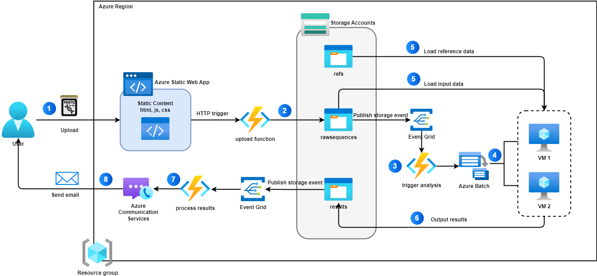
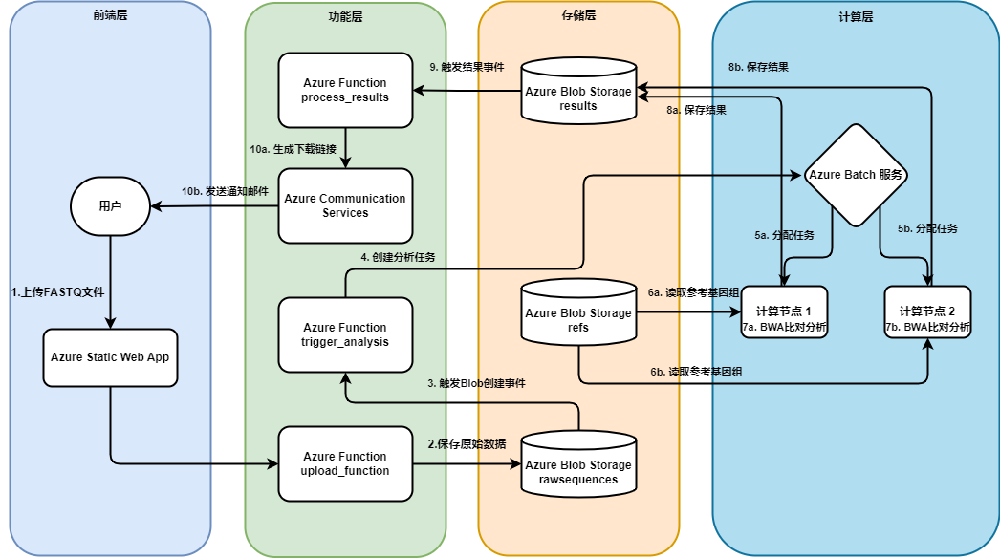

# 基因序列分析平台 - GeneFlow
## 项目概述
GeneFlow 是一个基于 Azure 云服务的基因序列分析平台，允许用户上传 FASTQ 格式的测序数据，使用 BWA 与参考基因组进行比对，并通过邮件接收分析结果。该解决方案充分利用了 Azure 的多种服务，包括静态网站托管、Azure Functions、Blob Storage、Azure Batch 和 Communication Services，构建了一个完整的无服务器工作流。

## 系统架构
1. 前端界面 ：Azure Static Web App托管静态网页，用于用户上传测序数据
2. 数据存储 ：Azure Blob Storage 存储原始数据、参考基因组和分析结果
3. 计算处理 ：Azure Batch 执行大规模并行计算任务
4. 任务协调 ：Azure Functions 处理上传、触发分析和发送结果
5. 通知系统 ：Azure Communication Services 发送邮件通知
## 功能特点
- 简洁的用户界面，支持 FASTQ 格式文件上传
- 自动化的分析流程，无需用户干预
- 完整的任务日志记录，包括起始时间、结束时间和运行时长
- 分析完成后通过邮件发送结果下载链接
- 错误监控和通知机制 Azure 基因序列分析平台部署详细指南
## 系统架构图

### 架构图说明

GeneFlow 系统架构基于 Azure 云服务构建，整个工作流程如下：

1. **用户交互与上传**：用户通过 Azure Static Web App 托管的网页界面上传 FASTQ 格式的基因序列数据
2. **文件上传处理**：Web应用触发 HTTP 请求，调用 upload_function 函数处理上传并将数据存储到 rawsequences 容器
3. **事件触发分析**：上传完成后，Event Grid 监听 rawsequences 存储事件，并触发 Azure Function 进行数据分析任务
4. **批量计算处理**：trigger_analysis 函数创建 Azure Batch 任务，Azure Batch 使用 BWA 工具执行基因序列比对分析
5. **数据加载**：计算节点从存储账户加载两类数据：参考基因组数据 (从 refs 容器)和测序数据 (从 rawsequences 容器)
6. **结果输出**：分析完成后，计算节点将结果输出到 results 容器
7. **结果处理**：Event Grid 捕获结果文件创建事件，process_results 函数被触发，处理分析结果并生成带有 SAS 令牌的下载链接
8. **用户通知**：处理完成后，Azure Function 通过 Azure Communication Services 发送电子邮件通知用户分析结果已生成，并提供结果文件的下载链接

这种基于事件驱动的微服务架构具有高可扩展性、高可用性和低维护成本，能够高效处理基因测序数据分析任务，为用户提供便捷的使用体验。所有组件都归属于同一个 Resource Group，便于统一管理和监控。

## 系统工作流程图

## 以下是通过 Azure Portal 部署基因序列分析平台的详细步骤指南。

## 1. 创建资源组

1. 登录 [Azure Portal](https://portal.azure.com/)
2. 点击左侧菜单的"资源组"
3. 点击"创建"按钮
4. 填写以下信息：
   - 订阅：选择您的 Azure 订阅
   - 资源组名称：输入 `GeneFlowResourceGroup`
   - 区域：选择 `东亚` 或离您最近的区域
5. 点击"查看 + 创建"，然后点击"创建"

## 2. 创建存储账户

1. 在 Azure Portal 中，点击"创建资源"
2. 搜索并选择"存储账户"
3. 点击"创建"
4. 填写以下信息：
   - 订阅：选择您的 Azure 订阅
   - 资源组：选择 `GeneFlowResourceGroup`
   - 存储账户名称：输入 `geneflowstorage`（名称必须全局唯一）
   - 区域：选择与资源组相同的区域
   - 性能：选择"标准"
   - 冗余：选择"本地冗余存储 (LRS)"
5. 点击"查看 + 创建"，然后点击"创建"
6. 部署完成后，点击"前往资源"

### 2.1 创建 Blob 容器

1. 在存储账户页面，点击左侧菜单的"容器"（在"数据存储"部分）
2. 点击"+ 容器"
3. 创建以下三个容器：
   - 名称：`rawsequences`，公共访问级别：`私有`
   - 名称：`refs`，公共访问级别：`私有`
   - 名称：`results`，公共访问级别：`私有`

### 2.2 获取存储账户连接字符串

1. 在存储账户页面，点击左侧菜单的"访问密钥"（在"安全性 + 网络"部分）
2. 点击"显示密钥"
3. 复制"连接字符串"（通常是 `key1` 下方的连接字符串），保存到安全的地方，后续配置会用到

### 2.3 上传参考基因组文件

1. 解压 `ref.zip` 文件到本地文件夹
2. 在存储账户页面，点击左侧菜单的"容器"
3. 点击 `refs` 容器
4. 点击"上传"
5. 点击"浏览文件"，选择解压后的参考基因组文件
6. 点击"上传"

## 3. 设置 Azure Communication Services

1. 在 Azure Portal 中，点击"创建资源"
2. 搜索并选择"Communication Services"
3. 点击"创建"
4. 填写以下信息：
   - 订阅：选择您的 Azure 订阅
   - 资源组：选择 `GeneFlowResourceGroup`
   - 资源名称：输入 `geneflowcomm`
   - 数据位置：选择与资源组相同的区域
5. 点击"查看 + 创建"，然后点击"创建"
6. 部署完成后，点击"前往资源"

### 3.1 配置电子邮件服务

1. 在 Communication Services 资源页面，点击左侧菜单的"电子邮件"
2. 点击"开始使用"
3. 选择"使用 Azure 托管域"（使用 Azure 免费提供的托管域）
4. 在"发件人地址"中输入您想要的前缀（例如 `noreply`）
5. 域名将自动设置为 Azure 提供的免费域名（如 `*.azurecomm.net`）
6. 点击"创建"
7. 等待验证完成，状态变为"活动"

### 3.2 获取 Communication Services 连接字符串

1. 在 Communication Services 资源页面，点击左侧菜单的"密钥"
2. 复制"主连接字符串"，保存到安全的地方，后续配置会用到

## 4. 设置 Azure Batch 服务

1. 在 Azure Portal 中，点击"创建资源"
2. 搜索并选择"Batch 服务"
3. 点击"创建"
4. 填写以下信息：
   - 订阅：选择您的 Azure 订阅
   - 资源组：选择 `GeneFlowResourceGroup`
   - 账户名称：输入 `geneflowbatch`
   - 位置：选择与资源组相同的区域
   - 存储账户：选择之前创建的 `geneflowstorage`
5. 点击"查看 + 创建"，然后点击"创建"
6. 部署完成后，点击"前往资源"

### 4.1 创建计算池

1. 在 Batch 服务页面，点击左侧菜单的"池"
2. 点击"添加"
3. 填写以下信息：
   - 池 ID：输入 `geneflowpool`
   - 操作系统：选择 `Ubuntu Server 22.04-LTS`
   - 节点大小：选择 `Standard_D2s_v3`
   - 专用节点：设置为 `2`（或根据您的需求调整）
   - 低优先级节点：设置为 `0`
   - 启用自动缩放：根据需求选择
4. 在"启动任务"部分：
   - 命令行：输入 `/bin/bash -c "apt-get update && apt-get install -y bwa samtools && mkdir -p /mnt/batch/tasks/shared"`
   - 用户标识：选择"池用户"
   - 等待任务成功：选择"是"
5. 点击"确定"创建池

### 4.2 获取 Batch 账户密钥和 URL

1. 在 Batch 服务页面，点击左侧菜单的"密钥"
2. 复制"主密钥"和"URL"，保存到安全的地方，后续配置会用到

## 5. 创建 Function App

1. 在 Azure Portal 中，点击"创建资源"
2. 搜索并选择"Function App"
3. 点击"创建"
4. 填写以下信息：
   - 订阅：选择您的 Azure 订阅
   - 资源组：选择 `GeneFlowResourceGroup`
   - Function App 名称：输入 `geneanalysisapp`
   - 发布：选择"代码"
   - 运行时堆栈：选择 `Python`
   - 版本：选择 `3.11`
   - 区域：选择与资源组相同的区域
   - 操作系统：选择 `Linux`
   - 计划类型：选择"消耗（无服务器）"
5. 点击"查看 + 创建"，然后点击"创建"
6. 部署完成后，点击"前往资源"

### 5.1 配置 Function App 设置

1. 在 Function App 页面，点击左侧菜单的"配置"
2. 点击"新建应用程序设置"
3. 添加以下设置（每个设置都需要点击"新建应用程序设置"）：
   - 名称：`STORAGE_CONNECTION_STRING`，值：之前保存的存储账户连接字符串
   - 名称：`BATCH_ACCOUNT_NAME`，值：`geneflowbatch`
   - 名称：`BATCH_ACCOUNT_KEY`，值：之前保存的 Batch 账户主密钥
   - 名称：`BATCH_ACCOUNT_URL`，值：之前保存的 Batch URL
   - 名称：`BATCH_POOL_ID`，值：`geneflowpool`
   - 名称：`COMMUNICATION_SERVICES_CONNECTION_STRING`，值：之前保存的 Communication Services 连接字符串
   - 名称：`FROM_EMAIL`，值：您配置的发件人电子邮件地址（例如 `noreply@yourdomain.azurecomm.net`）
   - 名称：`ADMIN_EMAIL`，值：您的管理员电子邮件地址
4. 点击"保存"

### 5.2 使用 VS Code 开发 Function 代码

#### 5.2.1 准备开发环境

1. 确保已安装以下软件：
   - [Visual Studio Code](https://code.visualstudio.com/)
   - [Python 3.11](https://www.python.org/downloads/)
   - [Azure Functions Core Tools](https://github.com/Azure/azure-functions-core-tools)
   - [Azure CLI](https://docs.microsoft.com/zh-cn/cli/azure/install-azure-cli)

2. 在 VS Code 中安装以下扩展：
   - [Azure Functions](https://marketplace.visualstudio.com/items?itemName=ms-azuretools.vscode-azurefunctions)
   - [Python](https://marketplace.visualstudio.com/items?itemName=ms-python.python)
   - [Azure Account](https://marketplace.visualstudio.com/items?itemName=ms-vscode.azure-account)

#### 5.2.2 创建本地 Function 项目

1. 打开 VS Code
2. 按 `Ctrl+Shift+P` 打开命令面板
3. 输入并选择 `Azure Functions: Create New Project...`
4. 选择项目文件夹（例如 `GeneFlow\geneanalysisapp`）
5. 选择语言 `Python`
6. 选择 Python 版本 `3.11`
7. 选择 `Model V2` 模式（这是最新的 Python Functions 编程模型）
8. 选择 `Skip for now` 暂时跳过创建函数

#### 5.2.3 步骤 3：添加第一个函数 - 文件上传处理

1. 在 Azure Functions 扩展中点击"创建函数"
2. 选择"HTTP触发器"
3. 函数名称：输入 `upload_function`
4. 授权级别：选择 `Anonymous`
5. 创建完成后，VS Code 会生成 `function_app.py` 文件

#### 5.2.4 步骤 4：添加第二个函数 - 分析任务触发器

1. 在 Azure Functions 扩展中点击"创建函数"
2. 选择"EventGridEvent"
3. 函数名称：输入 `trigger_analysis`
4. 创建完成后，VS Code 会更新 `function_app.py` 文件

#### 5.2.5 步骤 5：添加第三个函数 - 结果处理和邮件通知

1. 在 Azure Functions 扩展中点击"创建函数"
2. 选择"EventGridEvent"
3. 函数名称：输入 `process_results`
4. 创建完成后，VS Code 会更新 `function_app.py` 文件

#### 5.2.6 编写函数代码

完成上述步骤后，您需要编辑 `function_app.py` 文件，实现以下功能：

1. `upload_function`: 处理用户通过前端上传的 FASTQ 文件，将文件保存到 Blob Storage
2. `trigger_analysis`: 当新的 FASTQ 文件上传到 `rawsequences` 容器时触发，创建 Azure Batch 任务执行基因分析
3. `process_results`: 当分析结果保存到 `results` 容器时触发，生成下载链接并发送邮件通知

## 6. 创建 Azure Static Web App

1. 在 Azure Portal 中，点击"创建资源"
2. 搜索并选择"Static Web App"
3. 点击"创建"
4. 填写以下信息：
   - 订阅：选择您的 Azure 订阅
   - 资源组：选择 `GeneFlowResourceGroup`
   - 名称：输入 `geneflow-web`
   - 托管计划：选择"免费"
   - 区域：选择与资源组相同的区域
   - 源：选择"其他"（我们将手动部署）
5. 点击"查看 + 创建"，然后点击"创建"
6. 部署完成后，点击"前往资源"

### 6.1 获取部署令牌

1. 在 Static Web App 页面，点击左侧菜单的"概述"
2. 点击"管理部署令牌"
3. 复制部署令牌，保存到安全的地方

### 6.2 更新前端配置

1. 打开 `gene-analysis-web\script.js` 文件
2. 将第 2 行的 `FUNCTION_APP_URL` 更新为您的 Function App URL（格式为 `https://geneanalysisapp.azurewebsites.net`）
3. 保存文件

### 6.3 部署前端文件

使用 Static Web App CLI 部署静态网站：

1. 确保已安装 [Static Web App CLI]`npm install -g @azure/static-web-apps-cli`
2. 使用令牌部署 `swa deploy ./gene-analysis-web --deployment-token <deployment-token>`

## 7. 配置事件订阅

### 7.1 为原始数据容器创建事件订阅

1. 返回到 `geneflowstorage` 存储账户页面
2. 点击左侧菜单的"事件"
3. 点击"事件订阅"
4. 填写以下信息：
   - 名称：输入 `rawsequences-created`
   - 事件架构：选择"事件网格架构"
   - 系统主题名称：保持默认值
   - 筛选到事件类型：选择 `Blob Created`
   - 筛选到主题：`Subject Ends With`输入 `input.fq.gz`
   - 终结点类型：选择"Azure 函数"
   - 终结点：选择您的 Function App 和 `trigger_analysis` 函数
5. 点击"创建"

### 7.2 为结果容器创建事件订阅

1. 重复上述步骤，但使用以下不同的值：
   - 名称：输入 `results-created`
   - 筛选到主题：`Subject Ends With`输入 `_result.xls.gz`
   - 终结点：选择您的 Function App 和 `process_results` 函数
2. 点击"创建"

## 8. 验证部署

1. 访问之前记下的静态网站主终结点 URL
2. 输入您的电子邮件地址
3. 上传测试 FASTQ 文件（例如 `example/test.fq.gz`）
4. 点击"上传并分析"按钮
5. 验证上传是否成功，并记下任务 ID
6. 检查 Azure Portal 中的以下内容：
   - Blob 存储中是否有上传的文件
   - Batch 服务中是否创建了作业和任务
   - Function App 的日志是否显示处理过程
7. 等待分析完成，检查您的电子邮件是否收到结果通知
8. 点击邮件中的下载链接，验证是否可以下载结果文件

## 故障排除

如果在部署过程中遇到问题，请检查以下几点：

1. **Function App 日志**：在 Function App 页面，点击左侧菜单的"函数"，选择相应的函数，然后点击"监视"查看日志
2. **Batch 服务状态**：检查计算池是否正常运行
3. **事件订阅**：验证事件订阅是否正确配置
4. **应用程序设置**：确保所有必要的环境变量都已正确设置

完成以上步骤后，您的基因序列分析平台应该已经成功部署并可以使用了。用户可以通过静态网站上传测序数据，系统会自动处理并通过邮件发送结果。

